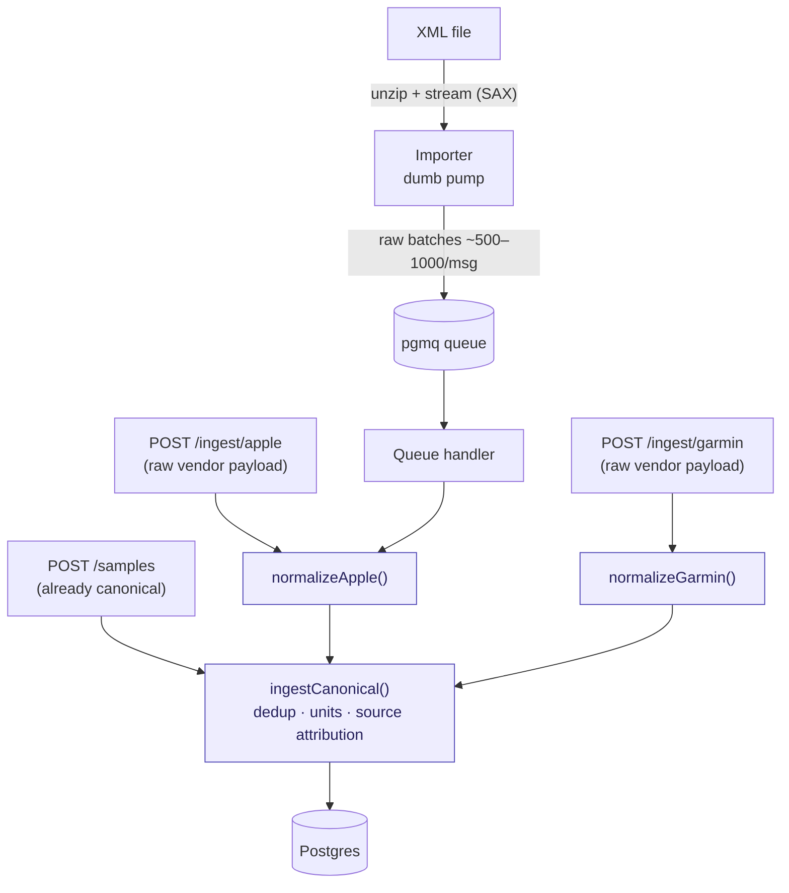
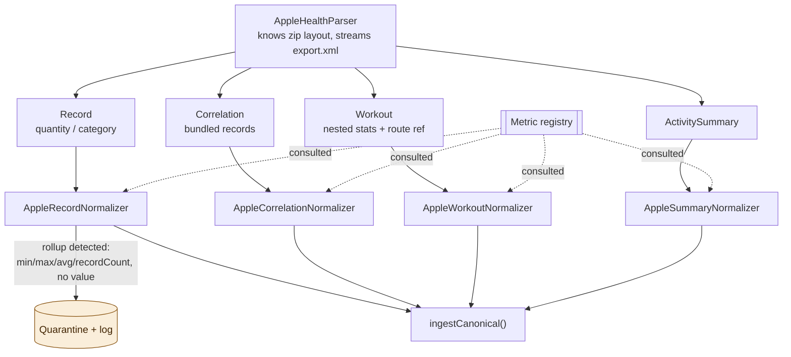
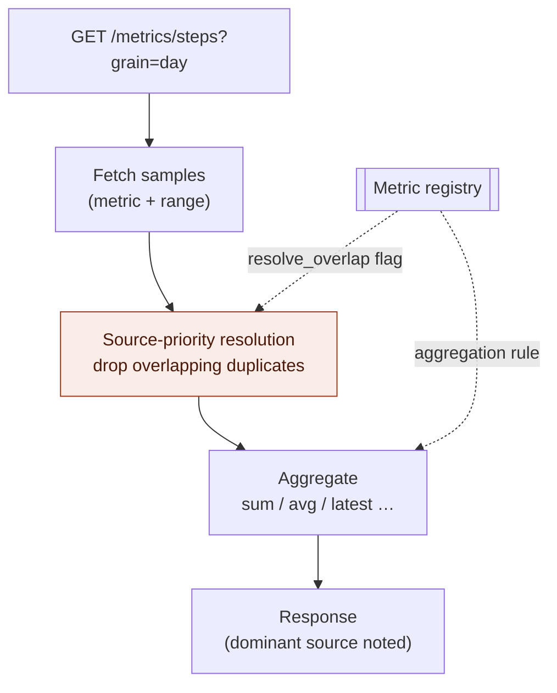

# Health Data Platform — Design & Implementation Handoff

> **Purpose of this document.** This is the complete design specification for a self-hosted health-data
> ingestion and normalization platform. It is written as a handoff for an implementing engineer (human or
> Claude Code) to build from. It captures *what* we are building, *why* each decision was made, the
> research that informed it, and the order in which to build it. Where a decision is deliberately deferred,
> it says so explicitly and puts it on the roadmap rather than leaving it ambiguous.

---

## 1. What this is

A **normalized health-data backend that other developers build on**. It ingests messy, vendor-specific
wearable data (starting with Apple Health) and serves it back as clean, consistent, queryable canonical
data — so that app-builders never have to parse an Apple Health XML export or reconcile units, duplicates,
and timezones themselves.

This is **infrastructure, not an end-user app**. The "user" of this system is a *developer*; the product
surface is the **API contract and the data model**, not a UI. The consequence of that framing drives every
decision below: the quality bar is **correctness, consistency, and predictability**, not features. A
health-data store that is occasionally wrong is worse than useless, because everything downstream inherits
the error silently.

### Stack (decided)

- **Language:** TypeScript
- **Database:** PostgreSQL
- **Queue:** [pgmq](https://github.com/pgmq/pgmq) (Postgres-native; no extra infrastructure — fits the
  self-hosted goal)
- **Deployment target:** runs locally / self-hosted first. Future monetization = hosted infrastructure.

### Non-goals (explicit scope boundaries)

These are deliberately out of scope. Drawing them now prevents scope creep.

- **No analysis or insights.** The system does not say "your sleep is trending down." That is the consumer
  app's job. We serve clean data and aggregates; interpretation lives downstream.
- **No visualization.**
- **No auth / multi-tenancy in v0–v2.** But the schema is designed so a tenant/subject key slots in later
  without a rewrite (see `subject_id`, §6).
- **No write-back to wearables.** Read/ingest only.

---

## 2. Who uses it, and the three consumer shapes to design against

Design the API so all three of these are first-class. They stress different parts of the system.

1. **Dashboard / analytics app** — reads aggregates over time ranges ("daily resting heart rate, last 90
   days"). Stresses the **query/aggregation** layer. Read-heavy, write-nothing.
2. **Journaling / correlation app** — joins across metrics on a timeline ("how does sleep relate to
   workouts?"). Stresses **time-alignment** — different metrics have different sampling rates and interval
   shapes.
3. **Live-sync companion app** — continuously pushes new samples from a phone. Stresses **ingestion
   throughput and dedup** — the same sample may arrive twice.

---

## 3. Capabilities (what it actually does)

- **Ingestion — two paths, shared core:**
  - Bulk: import an Apple Health XML export (slow, large, one-time-ish).
  - Incremental: accept samples via API (fast, continuous).
  - These are different enough to be almost two products sharing a schema: the XML path is a
    *parsing/batch* problem; the API path is a *validation/dedup* problem.
- **Normalization:** map every incoming sample onto the canonical metric vocabulary and canonical units,
  **preserving the original in metadata** so nothing is lost.
- **Query:** fetch raw samples by metric + time range + source, **and** fetch aggregates
  (hourly/daily rollups; sum/avg/min/max/latest depending on the metric). Aggregation is **not optional** —
  without it every consumer re-implements the same grouping logic, inconsistently.
- **Provenance:** always be able to answer "where did this number come from, and when was it written."

---

## 4. The hard parts (edge cases — this is where the value is)

These are not deferrable curiosities; they are the substance of why the product is worth building. If we
don't solve them, the developer has to, and then we offer little.

| Edge case | Why it bites | How we handle it |
|---|---|---|
| **Duplicates** | Same Apple Watch reading arrives via XML export *and* via live API sync. Apple itself stores cross-source duplicates. | Dedup identity at ingest (see §8). |
| **Overlapping / double-counted intervals** | iPhone steps + Watch steps over the same minute must **not** be summed. Naive `SUM(steps)` can be ~2× too high. | Source-priority resolution at read time (§7), per-metric flag in the registry. |
| **Unit drift** | Same metric arrives in different units (kg/lb, kcal/kJ, mg-dL/mmol-L). Apple is **not even internally consistent** — heart rate appears as both `count/min` and `count/s` across export versions. | Canonicalize on ingest via registry `unit_conversions`; keep original in `metadata`. |
| **Timezones** | "Daily steps" depends on *which* day, which depends on timezone. A sample at 11pm Tokyo vs "the same day" in Porto are different days. | Store `timestamptz` with offset; decide day-boundary policy explicitly and apply consistently (see §6, open question O3). |
| **Instant vs interval** | Heart rate is a point; steps span an interval. Aggregation math differs (average vs sum). | `temporal_kind` in the registry constrains valid `aggregation`. |
| **Backfill / corrections** | Vendors revise data (sleep re-scored hours later). Ingestion is **not** append-only. | Dedup identity + "last write wins" / update path. |
| **Malformed / partial exports** | Multi-GB exports are occasionally truncated or contain unknown types. | Importer is lenient: skip-and-log unknown types, never fail the whole import over one record. Ignore the embedded DTD. |
| **Pre-aggregated rollups** | Apple sometimes hands you *already-summarized* data (`min`/`max`/`average`/`recordCount`, **no `value`**) instead of raw samples. Blindly averaging these with raw samples = double-aggregation = garbage. | **Handle-and-log**: detect, quarantine, log — never drop, never naively merge. (§5, §8) |

---

## 5. Research findings (Apple Health data shape)

Confirmed against Apple's embedded DTD and real exports. These are facts the implementation must respect.

### Apple has exactly four top-level structural shapes

1. **`Record`** — covers **both** quantity and category data. Same attributes for both: `type`,
   `sourceName`, `sourceVersion`, `device`, `unit`, `creationDate`, `startDate`, `endDate`, `value`. The
   *only* difference is whether `value` parses as a number (quantity) or is an enum string (category).
   → This is why quantity + category collapse into one storage shape.
2. **`Workout`** — `workoutActivityType`, duration, total distance, total energy, **plus nested children**:
   `WorkoutEvent` (pauses/laps), `WorkoutStatistics` (per-metric aggregates within the workout), and
   `WorkoutRoute` (a **reference** to a separate GPX file, not inline data).
3. **`Correlation`** — a wrapper containing child `Record` elements (e.g. blood pressure = systolic +
   diastolic bundled).
4. **`ActivitySummary`** — daily ring totals, one row per day.

### Three findings that will break a naive importer

- **The schema is not stable, and the embedded DTD can be wrong.** Apple changed the DTD across iOS
  versions (`WorkoutStatistics` was *added* to the `Workout` definition); at least one real export shipped
  with a DTD that didn't declare elements the file actually contained, breaking strict parsers.
  → **Ignore the embedded DTD. Never validate against it. Be lenient.**
- **Two different encodings exist for the same metric.** Heart rate appears both as individual samples
  *and* as pre-aggregated daily rollups with `min`/`max`/`average`/`recordCount` and **no `value`
  attribute**. Units are inconsistent too (`count/s` vs `count/min`).
  → The normalizer cannot assume `value` is present, nor assume a fixed unit per metric. This is the
  **pre-aggregated rollup** case → handle-and-log.
- **Routes and ECGs live outside the XML.** `WorkoutRoute` → `FileReference` → a GPX file in a
  `workout-routes/` folder; ECGs are separate CSVs in an `electrocardiograms/` folder.
  → "Ingest an Apple export" really means "ingest a zip with cross-referenced files." For v0, defer
  routes/ECG, but the importer must know they exist.

### Performance reference

A streaming (SAX-style) parser that clears each element after processing reaches ~100k–200k records/sec and
yields in batches of ~50k. This validates the dumb-pump + batched-queue design: the bottleneck is parsing,
not the queue.

---

## 6. Architecture — the four pillars

### Pillar 1 — Ingestion topology: two front-ends, one shared core

The single most important structural principle: **separate the HTTP API, the normalization logic, and the
persistence logic into three things, and never glue normalization to the HTTP layer.**

- The **HTTP API** is the network surface (auth later, request validation, JSON shapes).
- The **normalization logic** turns a vendor format into canonical samples.
- The **persistence logic** turns canonical samples into DB rows (with dedup).

Make normalization + persistence a plain in-process TypeScript "core" module:

```
normalizeApple(raw)        // vendor → canonical
ingestCanonical(samples)   // canonical → DB (dedup, units, source attribution)
```

Both the HTTP handler **and** the queue handler call these in-process functions directly. **The queue
handler does NOT make HTTP calls to our own API** — that's slow, adds a failure mode, and is purely
ceremonial.



> Every arrow into `normalizeApple()` / `normalizeGarmin()` / `ingestCanonical()` (purple) is an **in-process
> function call**, not HTTP. The queue handler and the HTTP handlers share the same core.

**The importer is a dumb pump.** It unzips, streams `export.xml` (SAX, clear each element — never DOM, the
file can be multi-GB), and pushes **batched** raw records to pgmq. It does *no* parsing of semantics and
*no* normalization. Batch ~500–1000 records per queue message (millions of single-message enqueues is
needless overhead).

**Bulk path is async; API path is sync.** The XML import returns "import started" immediately and processes
in the background (no HTTP request blocks on a multi-GB parse). The API path is synchronous — a small
payload gets an immediate yes/no, which is what a live-sync app expects.

### Pillar 2 — The handler/normalizer seam: vendor-first, shape-second, registry-driven

Split handlers **by vendor at the top**, and within a vendor **dispatch by element shape — not by metric**.



**Why vendor-first:** the messy, divergent logic — zip layout, DTD quirks, the `min/max/average` rollup
format, unit drift, Apple's date-string parsing — is *entirely* vendor-specific. Garmin (FIT files + JSON
API) and Fitbit (JSON + intraday endpoints) have their own different messes. The thing that varies across
vendors is ~90% of the work, so that's the top-level seam.

**Why shape-second, not metric-second:** within Apple there are 100+ metric *types* but only **4 structural
shapes**. A `StepCount` record and a `HeartRate` record are parsed identically. Writing 100 near-identical
per-metric handlers would be absurd. Metric-specific knowledge does **not** belong in a handler — it belongs
in the **metric registry** (Pillar 4).

This cleanly separates the two kinds of change:
- **Add a vendor** = new parser + shape normalizers.
- **Add a metric** = one row in the registry, **zero code**. (Apple adds metrics every iOS release — you do
  not want a code change for each.)

This is also where "different vendors create different schemas for step data" is absorbed: that difference
lives entirely inside each vendor's normalizer, which emits the *same* canonical step sample regardless.

### Pillar 3 — Source priority: Posture A (resolved-by-default, opinionated)

**The problem:** overlapping data from multiple sources for the same metric and time. Walk around with
iPhone + Apple Watch and both count steps; for 10:00–10:01 the phone says 50 and the watch says 48. The
true number is ~48 — definitely **not** 98.

**Decision: Posture A.** The system is opinionated and resolves overlaps automatically, returning **one
clean resolved series**. No raw mode and no consumer-supplied priority override are exposed in the API. The
whole pitch is "we handle the messy parts," and overlap resolution is the messiest part — exposing rawness
would abdicate it.

**But three internal invariants (these are NOT Posture C creep — they're cheap insurance inside Posture A):**

1. **Priority order is config-table data, not hardcoded.** Ships with sane defaults (e.g. dedicated
   wearable > watch > phone). The consumer never sees it (that's what keeps it Posture A), but it's
   changeable without a deploy, and when multi-subject lands it becomes a per-subject row instead of a
   schema change. Cost: one tiny table. Avoids: a migration through a tens-of-millions-of-row dataset.
2. **Resolution is per-metric, not global.** Steps need resolution (additive, double-countable). Resting
   heart rate doesn't (averaging more samples is fine). Body weight wants "latest from most-trusted scale."
   → This is the `resolve_overlap` flag in the registry.
3. **Provenance preserved through resolution.** Even a resolved daily step count should still carry its
   dominant source ("primarily Apple Watch"). Reason: debuggability. The first time a number looks wrong
   you'll want to know which source was picked without re-running the pipeline. Nearly free to keep,
   painful to reconstruct.

**v0 resolution algorithm (deliberately simple):** within an aggregation bucket, for an additive metric,
pick the **single highest-priority source present and use only its samples; drop the others entirely** for
that bucket. Predictable, easy to explain, easy to test, correct in the common case (wore the watch all
day → the phone's overlapping steps are discarded). The more accurate "stitching" approach (priority source
where it exists, fall back to lower-priority sources only for gaps) is **roadmap** — defer until real data
shows the simple version loses meaningful coverage.

> ⚠️ **Posture A caveat:** because there's no raw mode, whatever the system computes is the *only* answer
> the consumer can get — a wrong resolution is silent and unrecoverable from their side. So validate the v0
> algorithm against real data before considering it locked.

**Read-path order is load-bearing:** fetch → **resolve overlap by source priority** → **then** aggregate
with registry-supplied math. If you sum first and dedup later, you've already double-counted.



> The resolution step (coral) is **correctness-critical** and must run **before** aggregation. Summing first
> and deduping later has already double-counted.

**Roadmap (Posture C):** `?resolve=false` (raw, all sources), `?priority=watch,phone` (consumer override),
stitching algorithm. None exposed in v0–v2.

### Pillar 4 — The metric registry

The single source of truth, consulted by **both** sides of the system:

- **On ingest (normalizer):** "I saw vendor type `HKQuantityTypeIdentifierStepCount` in unit `count` — what
  canonical metric is that, what canonical unit, number or label?"
- **On query:** "Someone asked for daily `steps` — sum or average? Resolve source overlaps? Who wins ties?"

Both sides reading the same table is what keeps ingestion and querying from drifting apart — they cannot
disagree about what "steps" means.

#### Registry entry fields

**Identity**
- `key` — canonical metric id, the stable public name. e.g. `"heart_rate"`.
- `display_name` — human label. e.g. `"Heart rate"`.
- `category` — grouping for discovery. e.g. `"vitals" | "activity" | "sleep"`.

**Value semantics**
- `value_type` — `numeric | categorical`. Decides whether the sample populates `value_num` or `value_text`.
- `canonical_unit` — the one true unit stored. e.g. `"count/min"`. Null if categorical.
- `allowed_values` — enum set, categorical only. e.g. `["in_bed","asleep_deep",...]`.
- `temporal_kind` — `instant | interval`. Point reading vs spans time.

**Ingest mapping (per vendor)**
- `aliases` — `(vendor, vendor_type) → key`. e.g. `apple:HKQuantityTypeIdentifierHeartRate → heart_rate`.
  **This is the mechanism behind "support many vendors."** Adding a vendor is mostly adding alias rows, not
  code. This is what makes the 2nd vendor (v2) cheap instead of a rewrite.
- `unit_conversions` — `incoming_unit → canonical`. e.g. `count/s → ×60 → count/min`. Keyed by *incoming
  unit* (not vendor), so the same metric absorbs whatever unit appears and always stores canonical. Original
  incoming unit preserved in sample `metadata`.

**Aggregation & resolution**
- `aggregation` — how to roll up within a bucket: `sum | avg | min | max | latest`.
- `resolve_overlap` — does this metric double-count across sources? `true` for steps, `false` for HR.

#### Registry constraints & subtleties

- **`temporal_kind` constrains `aggregation`.** You can sum interval metrics (steps) but summing instant
  metrics (heart rate) is nonsense. Enforce in the registry so a bad entry can't be created.
- **Storage shape (decided): separate tables, not embedded JSON.** A canonical `metrics` table, plus
  separate `metric_aliases` and `unit_conversions` tables that FK back. Keeps the canonical definition
  vendor-agnostic; adding a vendor is a pure insert; avoids an unbounded JSON blob.
- **Authoring vs storage (decided):** authored as **readable per-metric seed files** in the repo (one block
  per canonical metric with its vendor aliases nested, because that reads well). A **seed loader flattens**
  them into the normalized tables on deploy. File = human-friendly view; tables = query-friendly view;
  loader bridges them.
- **Source-of-truth & lifecycle (decided): versioned, deployed — NOT runtime-editable.** The registry is
  correctness-critical and low-churn. A wrong `aggregation`/`unit_conversion` silently corrupts every query
  on that metric — exactly what you want caught in code review and tied to a commit, not typed into a prod
  admin form. The DB tables are a *projection* of the code (a deployed cache), never edited directly. Every
  change is a reviewable diff with rollback.

#### Registry versioning & the two kinds of rule change

- **Ingest-side change** (new alias, corrected `unit_conversion`): only affects data ingested *after* the
  change. Already-stored samples were converted at ingest time and are not retroactively touched. Fixing a
  bad conversion leaves old-wrong and new-right data coexisting → a re-normalization path is needed
  eventually (roadmap).
- **Query-side change** (`aggregation`, `resolve_overlap`): takes effect **immediately and retroactively**,
  because aggregation happens at read time against raw samples. Fixing `steps` from `avg` to `sum` instantly
  corrects all history with no migration. (This is the upside of computing aggregates on read rather than
  precomputing.)
- **Therefore:** stamp a lightweight **registry `version`** (monotonic integer or git SHA of the seed) onto
  each ingested sample, recording which registry version normalized it. One small column now; it's what
  makes future targeted re-normalization possible ("find every sample ingested under the buggy version and
  reprocess just those").

---

## 7. Read/query model (summary)

- Aggregates computed **on read**, not precomputed — makes query-rule fixes retroactive and free, and avoids
  a precompute pipeline in v0. (If read performance becomes a problem at scale, precomputed rollups are a
  roadmap optimization, not a v0 concern.)
- Pipeline order (non-negotiable): **fetch → resolve overlap → aggregate**.
- Default endpoint shape (illustrative): `GET /metrics/{key}?grain={hour|day}&from=…&to=…` → resolved series
  with per-bucket dominant source noted.
- Day-boundary / timezone policy must be decided and applied consistently (open question O3).

---

## 8. Data model direction (NOT yet finalized — this is the next drill-down)

> This section is the agreed *direction*. The concrete DDL (partitioning strategy, indexes, exact column
> types, dedup constraint) is the **next design task** and was not finalized in this session. Build the rest
> against these shapes; pin the DDL first before writing ingestion.

**Hybrid model:** one big partitioned `samples` table for quantity + category data, plus **separate tables**
for the structurally-different shapes (`workouts`, `correlations`). Quantity + category are *almost* the same
shape and unify cleanly; workouts/correlations are rare (thousands, not millions) so dedicated tables cost
nothing and keep the big table clean.

### `samples` (the big partitioned table — tens of millions of rows per subject)

```
id              uuid | bigint
subject_id      fk            -- ALWAYS present; defaults to one hardcoded subject in v0 (see §below)
metric          text          -- canonical key from the registry, e.g. "heart_rate"
value_num       double?       -- quantity samples
value_text      text?         -- category samples (the enum label)
unit            text?         -- canonical unit, e.g. "count/min"
start_time      timestamptz
end_time        timestamptz   -- == start_time for instantaneous
source_id       fk            -- which device/app produced it
workout_id      fk?           -- set if this sample belongs to a workout
external_id     text?         -- vendor's own id, for dedup
registry_version int          -- which registry version normalized this (see §6)
metadata        jsonb         -- vendor extras not yet canonicalized (escape hatch — nothing is lost)
```

- `metadata` JSONB is the escape hatch: unknown vendor fields go here instead of being dropped; promote to
  real columns later.
- Partition by **time range** (that's where partitioning earns its keep at this volume).

### `sources` (its own table — essential for dedup)

Device name, manufacturer, software version, vendor flag. Apple records this per-sample; it's essential for
dedup *and* for source-priority resolution.

### `workouts`

`workoutActivityType` → canonical, start/end, aggregate stats. Child samples (HR during the workout)
reference it via `samples.workout_id`. `WorkoutRoute`/GPX deferred to roadmap (note its existence).

### `correlations`

Bundle wrapper; child records reference it. (Blood pressure = systolic + diastolic.)

### `quarantine` (handle-and-log for rollups + unknowns)

Pre-aggregated rollup records and unparseable/unknown records land here, stored **untouched** with enough
context (raw payload, reason, registry version, timestamp) to **replay later**. Never dropped, never naively
merged. This is a first-class path, not an afterthought.

### `subject_id` — the seam (decided)

Even in v0, put a `subject_id` column on every data table, defaulted to one hardcoded subject. This is **not**
a user system — no auth, no accounts, no permissions. It is *only the seam*. Retrofitting a tenant key into a
tens-of-millions-of-row partitioned table later is genuinely painful (touches every index, partition, query).
Adding a column that's always `'default'` now costs nothing and removes the scariest future migration.

### Source-priority config tables (from Pillar 3)

`source_priority` (source → rank, possibly per-metric). Ships with defaults. Not consumer-visible in
Posture A. Becomes per-subject later.

---

## 9. API surface (direction)

> Shapes are illustrative; finalize alongside the DDL. The **canonical `/samples` contract is sacred** and
> must be versioned carefully — it's the stable core that both our own normalizers and external developers
> depend on. Vendor endpoints can evolve more freely.

**Ingest**
- `POST /ingest/apple` — accepts **raw** Apple payloads; runs `normalizeApple()` internally. This is where
  the product's value lives ("you don't have to know how to normalize Apple data"). The XML importer is just
  the bulk/file front-end onto this same normalization path.
- `POST /ingest/{vendor}` — one per supported vendor (roadmap as vendors are added).
- `POST /samples` — accepts **already-canonical** samples (metric, value, unit, source, timestamps). The
  clean, stable, vendor-neutral contract for developers with clean data or an unsupported vendor. They take
  on normalization themselves.
- `POST /import/apple` (or a CLI command) — kicks off a bulk XML import; returns immediately (async).

**Query**
- `GET /metrics/{key}?grain={hour|day}&from=…&to=…` — resolved, aggregated series (Posture A).
- `GET /samples?metric=…&from=…&to=…&source=…` — raw samples (for the correlation/journaling consumer).
- Discovery endpoint(s) for available metrics/categories (reads the registry).

**Why both `/ingest/*` and `/samples`:** developers who want the easy path send raw vendor data and we handle
everything; developers who need control (custom device, pre-cleaned data, unsupported vendor) use `/samples`.
Neither group is forced onto the wrong path, and we don't pretend to normalize a vendor we've never seen.

---

## 10. Roadmap (sequenced by risk — front-load what's hard to change later)

- **v0 — Apple, one subject, correctness-first.** XML import + canonical schema + dedup + correct
  aggregation with source-priority. **No API ingestion yet.** Goal: prove the hard parts (dedup,
  double-counting, timezones, rollup handle-and-log) on *real* personal data. This is where the product's
  value is won or lost. **Validate the v0 source-priority algorithm against real data here.**
- **v1 — The API.** Ingestion endpoints (`/ingest/apple`, `/samples`) + query/aggregate endpoints. Now
  usable by a real app. **Stabilize the canonical API contract here** — once apps depend on it, changing it
  is expensive.
- **v2 — Second vendor** (Garmin or Fitbit). The real test of the canonical model: the first vendor always
  fits the schema (we built it for them); the second reveals wrong assumptions. Do this **before**
  monetizing — it validates the core promise. Mostly registry alias rows + a new parser/normalizer.
- **v3 — Multi-subject + the infra/hosting business.** Introduce the tenancy concept the `subject_id` seam
  has been holding open, plus auth, rate limits, usage metering. The monetization layer.

**Deferred items (explicitly on the roadmap, not forgotten):**
- Posture C: raw mode (`?resolve=false`), consumer priority overrides, stitching resolution algorithm.
- Workout routes (GPX) and ECG ingestion.
- Re-normalization / replay pipeline (reprocess samples ingested under a buggy registry version; replay
  quarantine).
- Precomputed rollups (read-performance optimization) if on-read aggregation becomes a bottleneck at scale.

---

## 11. Open questions to resolve before/while building v0

- **O1 — Concrete `samples` DDL:** partitioning strategy (range by month?), index set (the dedup index is
  the critical one), exact `id` type (uuid vs bigint). *Next design task.*
- **O2 — Dedup identity:** the exact tuple/constraint that defines "the same sample." Candidate:
  `(subject_id, metric, source_id, start_time, end_time, value)` or a vendor `external_id` when present.
  Must also define update/backfill behavior (last-write-wins?).
- **O3 — Timezone / day-boundary policy:** are "days" computed in each sample's local offset, or a fixed
  subject timezone? Must be consistent across the whole aggregation layer. People travel — pick a rule and
  document it.
- **O4 — Validate the v0 source-priority algorithm** ("highest-priority source wins the bucket") against
  real personal data with heavy watch/phone overlap, before treating it as locked (Posture A makes it
  unrecoverable downstream).

---

## 12. Decision log (quick reference)

| # | Decision | Status |
|---|---|---|
| D1 | Canonical cross-vendor model (not raw-per-vendor) | **Decided** |
| D2 | TypeScript + PostgreSQL + pgmq; self-hosted first | **Decided** |
| D3 | Hybrid schema: one partitioned `samples` table + side tables for workouts/correlations | **Decided (direction)** |
| D4 | `subject_id` everywhere from v0 (seam only, not a user system) | **Decided** |
| D5 | Importer is a dumb pump → batched raw records → pgmq | **Decided** |
| D6 | Queue handler + API both call shared in-process core; no self-HTTP | **Decided** |
| D7 | Two ingest endpoints: `/ingest/{vendor}` (raw) and `/samples` (canonical) | **Decided** |
| D8 | Handlers: vendor-first, then by element shape; metric specifics in the registry | **Decided** |
| D9 | Pre-aggregated rollups: handle-and-log (quarantine + log), never drop/merge | **Decided** |
| D10 | Source priority = Posture A (resolved-by-default, opinionated) | **Decided** |
| D11 | …but priority order is config data, resolution is per-metric, provenance preserved | **Decided** |
| D12 | v0 resolution algorithm: highest-priority source wins the whole bucket | **Decided (pending real-data validation)** |
| D13 | Read pipeline order: fetch → resolve overlap → aggregate | **Decided** |
| D14 | Aggregates computed on read, not precomputed | **Decided** |
| D15 | Registry: separate `metrics` / `metric_aliases` / `unit_conversions` tables | **Decided** |
| D16 | Registry authored as seed files, flattened into tables by a loader | **Decided** |
| D17 | Registry is versioned & deployed, NOT runtime-editable; tables are a projection of code | **Decided** |
| D18 | Stamp `registry_version` onto each sample for future re-normalization | **Decided** |
| D19 | Ignore Apple's embedded DTD; lenient streaming (SAX) parse; skip-and-log unknowns | **Decided** |
| D20 | Concrete DDL, dedup identity, timezone policy | **Open (O1–O3)** |

---

*End of handoff. The recommended first implementation step is resolving O1–O3 (the concrete data model),
because everything in ingestion is written against it.*
